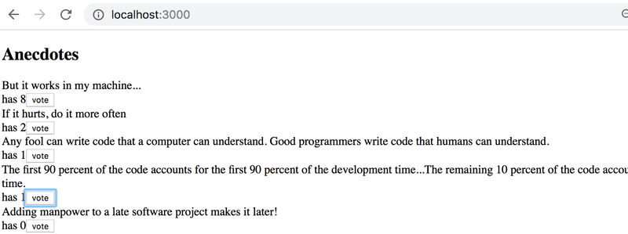
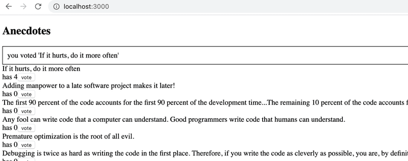
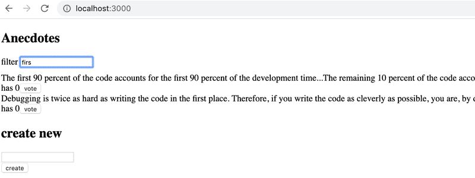

# Exercises

> ## Exercises 6.3.-6.8.

Let's make a new version of the anecdote voting application from part 1. Take the project from [this repository](https://github.com/fullstack-hy2020/redux-anecdotes) to base your solution on.

If you clone the project into an existing git-repository, remove the git-configuration of the cloned application.

After completing these exercises, your application should look like this:



## 6.3: anecdotes, step1

Implement the functionality for voting anecdotes. The amount of votes must be saved to a Redux-store.

## 6.4: anecdotes, step2

Implement the functionality for adding new anecdotes.

You can keep the form uncontrolled, like we did earlier.

## 6.5: anecdotes, step3

Make sure that the anecdotes are ordered by the number of votes.

## 6.6: anecdotes, step4

If you haven't done so already, separate the creation of `action-objects` to `action creator-functions` and place them in the `src/reducers/anecdoteReducer.js` file, so do like we have been doing since the chapter action creators.

## 6.7: anecdotes, step5

Separate the creation of new anecdotes into its own component called _AnecdoteForm_. Move all logic for creating a new anecdote into this new component.

## 6.8: anecdotes, step6

Separate the rendering of the anecdote list into its own component called _AnecdoteList_. Move all logic related to voting for an anecdote to this new component.

Now the App component should look like this:

```js
import AnecdoteForm from './components/AnecdoteForm';
import AnecdoteList from './components/AnecdoteList';

const App = () => {
    return (
        <div>
            <h2>Anecdotes</h2>
            <AnecdoteForm />
            <AnecdoteList />
        </div>
    );
};

export default App;
```

> ## Exercises 6.9.-6.12.

Let's continue working on the anecdote application using Redux that we started in exercise 6.3.

## 6.9 Better anecdotes, step7

Install Redux Toolkit for the project. Move the Redux store creation into its own file _store.js_ and use Redux Toolkit's `configureStore` to create the store. Also, start using Redux DevTools to debug the application's state easier.

## 6.10 Better anecdotes, step8

The application has a ready-made body for the _Notification_ component:

```js
const Notification = () => {
    const style = {
        border: 'solid',
        padding: 10,
        borderWidth: 1,
    };
    return <div style={style}>render here notification...</div>;
};

export default Notification;
```

Extend the component so that it renders the message stored in the Redux store, making the component take the following form:

```js
import { useSelector } from 'react-redux';

const Notification = () => {
    const notification = useSelector(/* something here */);
    const style = {
        border: 'solid',
        padding: 10,
        borderWidth: 1,
    };
    return <div style={style}>{notification}</div>;
};
export default Notification;
```

You will have to make changes to the application's existing reducer. Create a separate reducer for the new functionality by using the Redux Toolkit's `createSlice` function. Also, refactor the application so that it uses a combined reducer as shown in this part of the course material.

The application does not have to use the _Notification_ component in an intelligent way at this point in the exercises. It is enough for the application to display the initial value set for the message in the _notificationReducer._

## 6.11 Better anecdotes, step9

Extend the application so that it uses the _Notification_ component to display a message for five seconds when the user votes for an anecdote or creates a new anecdote:  


It's recommended to create separate [action creators](https://redux-toolkit.js.org/api/createSlice#reducers) for setting and removing notifications.

## 6.12\* Better anecdotes, step10

Implement filtering for the anecdotes that are displayed to the user.  


Store the state of the filter in the redux store. It is recommended to create a new reducer and action creators for this purpose. Implement the reducer and action creators using the Redux Toolkit's `createSlice` function.

Create a new _Filter_ component for displaying the filter. You can use the following code as a template for the component:

```js
const Filter = () => {
    const handleChange = (event) => {
        // input-field value is in variable event.target.value
    };
    const style = {
        marginBottom: 10,
    };

    return (
        <div style={style}>
            filter <input onChange={handleChange} />
        </div>
    );
};

export default Filter;
```
